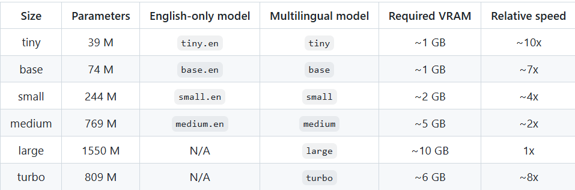

# Voice-Assistant

1
1.1 Audio Pipeline
Mic → VAD → Wake Word → ASR → Intent → Action

Wake word- porcupine(always listening so cant,ultra low false positive and false negatives, on device)
ASR - whisper(tiny/base)

Target-
 accuracy>90    
 no ghost trigger in 10 min silence  
 stable contiuous listening for 30min 

1.2 Intent
Rule-Based -> fallback to LLM 

command schema, intent classifier, slot extraction

1.3 Command Memory

session memory store,entity tracking, reference resolution

2.1 VoiceOS

open,close,volumne control,screenshot,file rename
then browser() - difficult to implement

2.2 Safety Layer
confiramation for destructive commands
undo buffer
acion timeout 
fai-safe cancel

2.3 Telemetry
latency, ASR confidence, intent confidence, action success/faliure

4.Voice Browse
flaky, DOM-dependent, slow, brittle across sites

One OS -> multiOS

